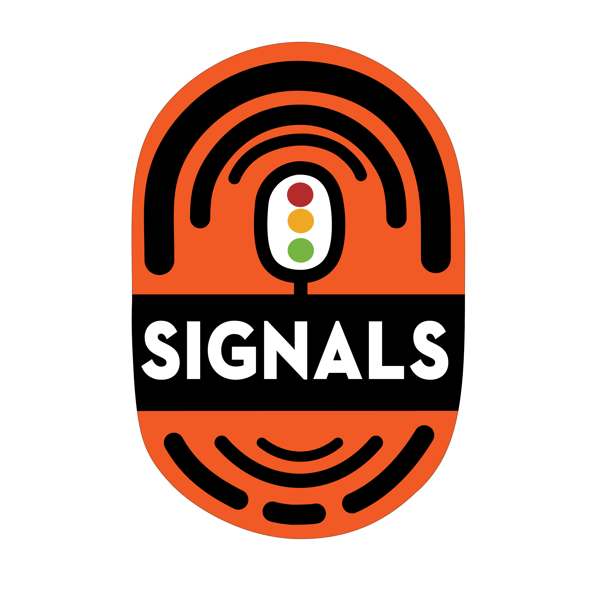

# 🚦 JavaScript Signals standard proposal🚦


Stage 0

Authors: Rob Eisenberg and Daniel Ehrenberg

This document describes an early common direction for signals in JavaScript, similar to the Promises/A+ effort which preceded the Promises standardized by TC39 in ES2015. Try it for yourself, using [a polyfill](https://github.com/proposal-signals/proposal-signals/tree/main/packages/signal-polyfill).

Similarly to Promises/A+, this effort focuses on aligning the JavaScript ecosystem. If this alignment is successful, then a standard could emerge, based on that experience. Several framework authors are collaborating here on a common model which could back their reactivity core. The current draft is based on design input from the authors/maintainers of [Angular](https://angular.io/), [Bubble](https://bubble.io/), [Ember](https://emberjs.com/), [FAST](https://www.fast.design/), [MobX](https://mobx.js.org/), [Preact](https://preactjs.com/), [Qwik](https://qwik.dev/), [RxJS](https://rxjs.dev/), [Solid](https://www.solidjs.com/), [Starbeam](https://www.starbeamjs.com/), [Svelte](https://svelte.dev/), [Vue](https://vuejs.org/), [Wiz](https://blog.angular.io/angular-and-wiz-are-better-together-91e633d8cd5a), and more…

Differently from Promises/A+, we're not trying to solve for a common developer-facing surface API, but rather the precise core semantics of the underlying signal graph. This proposal does include a fully concrete API, but the API is not targeted to most application developers. Instead, the signal API here is a better fit for frameworks to build on top of, providing interoperability through common signal graph and auto-tracking mechanism.

The plan for this proposal is to do significant early prototyping, including integration into several frameworks, before advancing beyond Stage 1. We are only interested in standardizing Signals if they are suitable for use in practice in multiple frameworks, and provide real benefits over framework-provided signals. We hope that significant early prototyping will give us this information. See "Status and development plan" below for more details.

## Background: Why Signals?

To develop a complicated user interface (UI), JavaScript application developers need to store, compute, invalidate, sync, and push state to the application's view layer in an efficient way. UIs commonly involve more than just managing simple values, but often involve rendering computed state which is dependent on a complex tree of other values or state that is also computed itself. The goal of Signals is to provide infrastructure for managing such application state so developers can focus on business logic rather than these repetitive details.

Signal-like constructs have independently been found to be useful in non-UI contexts as well, particularly in build systems to avoid unnecessary rebuilds.

Signals are used in reactive programming to remove the need to manage updating in applications.

> A declarative programming model for updating based on changes to state. 

from _[What is Reactivity?](https://www.pzuraq.com/blog/what-is-reactivity)_.

#### Example - A VanillaJS Counter

Given a variable, `counter`, you want to render into the DOM whether the counter is even or odd. Whenever the `counter` changes, you want to update the DOM with the latest parity. In Vanilla JS, you might have something like this:

```js
let counter = 0;
const setCounter = (value) => {
  counter = value;
  render();
};

const isEven = () => (counter & 1) == 0;
const parity = () => isEven() ? "even" : "odd";
const render = () => element.innerText = parity();

// Simulate external updates to counter...
setInterval(() => setCounter(counter + 1), 1000);
```

This has a number of problems...

* The `counter` setup is noisy and boilerplate-heavy.
* The `counter` state is tightly coupled to the rendering system.
* If the `counter` changes but `parity` does not (e.g. counter goes from 2 to 4), then we do unnecessary computation of the parity and unnecessary rendering.
* What if another part of our UI just wants to render when the `counter` updates?
* What if another part of our UI is dependent on `isEven` or `parity` alone?

Even in this relatively simple scenario, a number of issues arise quickly. We could try to work around these by introducing pub/sub for the `counter`. This would allow additional consumers of the `counter` could subscribe to add their own reactions to state changes.

However, we're still stuck with the following problems:

* The render function, which is only dependent on `parity` must instead "know" that it actually needs to subscribe to `counter`.
* It isn't possible to update UI based on either `isEven` or `parity` alone, without directly interacting with `counter`.
* We've increased our boilerplate. Any time you are using something, it's not just a matter of calling a function or reading a variable, but instead subscribing and doing updates there. Managing unsubscription is also especially complicated.

Now, we could solve a couple issues by adding pub/sub not just to `counter` but also to `isEven` and `parity`. We would then have to subscribe `isEven` to `counter`,  `parity` to `isEven`, and `render` to `parity`. Unfortunately, not only has our boilerplate code exploded, but we're stuck with a ton of bookkeeping of subscriptions, and a potential memory leak disaster if we don't properly clean everything up in the right way. So, we've solved some issues but created a whole new category of problems and a lot of code. To make matters worse, we have to go through this entire process for every piece of state in our system.

### Introducing Signals

Data binding abstractions in UIs for the model and view have long been core to UI frameworks across multiple programming languages, despite the absence of any such mechanism built into JS or the web platform. Within JS frameworks and libraries, there has been a large amount of experimentation across different ways to represent this binding, and experience has shown the power of one-way data flow in conjunction with a first-class data type representing a cell of state or computation derived from other data, now often called "Signals".
This first-class reactive value approach seems to have made its first popular appearance in open-source JavaScript web frameworks with [Knockout](https://knockoutjs.com/) [in 2010](https://blog.stevensanderson.com/2010/07/05/introducing-knockout-a-ui-library-for-javascript/). In the years since, many variations and implementations have been created. Within the last 3-4 years, the Signal primitive and related approaches have gained further traction, with nearly every modern JavaScript library or framework having something similar, under one name or another.

To understand Signals, let's take a look at the above example, re-imagined with a Signal API further articulated below.

#### Example - A Signals Counter

```js
const counter = new Signal.State(0);
const isEven = new Signal.Computed(() => (counter.get() & 1) == 0);
const parity = new Signal.Computed(() => isEven.get() ? "even" : "odd");

// A library or framework defines effects based on other Signal primitives
declare function effect(cb: () => void): (() => void);

effect(() => element.innerText = parity.get());

// Simulate external updates to counter...
setInterval(() => counter.set(counter.get() + 1), 1000);
```

There are a few things we can see right away:
* We've eliminated the noisy boilerplate around the `counter` variable from our previous example.
* There is a unified API to handle values, computations, and side effects.
* There's no circular reference problem or upside down dependencies between `counter` and `render`.
* There are no manual subscriptions, nor is there any need for bookkeeping.
* There is a means of controlling side-effect timing/scheduling.

Signals give us much more than what can be seen on the surface of the API though:

* **Automatic Dependency Tracking** - A computed Signal automatically discovers any other Signals that it is dependent on, whether those Signals be simple values or other computations.
* **Lazy Evaluation** - Computations are not eagerly evaluated when they are declared, nor are they immediately evaluated when their dependencies change. They are only evaluated when their value is explicitly requested.
* **Memoization** - Computed Signals cache their last value so that computations that don't have changes in their dependencies do not need to be re-evaluated, no matter how many times they are accessed.

## Motivation for standardizing Signals

#### Interoperability

Each Signal implementation has its own auto-tracking mechanism, to keep track of the sources encountered when evaluating a computed Signal. This makes it hard to share models, components, and libraries between different frameworks--they tend to come with a false coupling to their view engine (given that Signals are usually implemented as part of JS frameworks).

A goal of this proposal is to fully decouple the reactive model from the rendering view, enabling developers to migrate to new rendering technologies without rewriting their non-UI code, or develop shared reactive models in JS to be deployed in different contexts. Unfortunately, due to versioning and duplication, it has turned out to be impractical to reach a strong level of sharing via JS-level libraries--built-ins offer a stronger sharing guarantee.

#### Performance/Memory usage

It is always a small potential performance boost to ship less code due to commonly used libraries being built-in, but implementations of Signals are generally pretty small, so we don't expect this effect to be very large.

We suspect that native C++ implementations of Signal-related data structures and algorithms can be slightly more efficient than what is achievable in JS, by a constant factor. However, no algorithmic changes are anticipated vs. what would be present in a polyfill; engines are not expected to be magic here, and the reactivity algorithms themselves will be well-defined and unambiguous.

The champion group expects to develop various implementations of Signals, and use these to investigate these performance possibilities.

#### DevTools

With existing JS-language Signal libraries, it can be difficult to trace things like:
* The callstack across a chain of computed Signals, showing the causal chain for an error
* The reference graph among Signals, when one depends on another -- important when debugging memory usage

Built-in Signals enable JS runtimes and DevTools to potentially have improved support for inspecting Signals, particularly for debugging or performance analysis, whether this is built into browsers or through a shared extension. Existing tools such as the element inspector, performance snapshot, and memory profilers could be updated to specifically highlight Signals in their presentation of information.

#### Secondary benefits

##### Benefits of a standard library 

In general, JavaScript has had a fairly minimal standard library, but a trend in TC39 has been to make JS more of a "batteries-included" language, with a high-quality, built-in set of functionality available. For example, Temporal is replacing moment.js, and a number of small features, e.g., `Array.prototype.flat` and `Object.groupBy` are replacing many lodash use cases. Benefits include smaller bundle sizes, improved stability and quality, less to learn when joining a new project, and a generally common vocabulary across JS developers.

##### HTML/DOM Integration (a future possibility)

Current work in W3C and by browser implementors is seeking to bring native templating to HTML ([DOM Parts][wicg-pr-1023] and [Template Instantiation][wicg-propsal-template-instantiation]). Additionally, the W3C Web Components CG is exploring the possibility of extending Web Components to offer a fully declarative HTML API. To accomplish both of these goals, eventually a reactive primitive will be needed by HTML. Additionally, many ergonomic improvements to the DOM through integration of Signals can be imagined and have been asked for by the community.

[wicg-pr-1023]: https://github.com/WICG/webcomponents/pull/1023
[wicg-propsal-template-instantiation]: https://github.com/WICG/webcomponents/blob/gh-pages/proposals/Template-Instantiation.md

> Note, this integration would be a separate effort to come later, not part of this proposal itself.

##### Ecosystem information exchange (*not* a reason to ship)

Standardization efforts can sometimes be helpful just at the "community" level, even without changes in browsers. The Signals effort is bringing together many different framework authors for a deep discussion about the nature of reactivity, algorithms and interoperability. This has already been useful, and does not justify inclusion in JS engines and browsers; Signals should only be added to the JavaScript standard if there are significant benefits *beyond* the ecosystem information exchange enabled.

## Design goals for Signals

It turns out that existing Signal libraries are not all that different from each other, at their core. This proposal aims to build on their success by implementing the important qualities of many of those libraries.

### Core features

* A Signal type which represents state, i.e. writable Signal. This is a value that others can read.
* A computed/memo/derived Signal type, which depends on others and is lazily calculated and cached.
    * Computation is lazy, meaning computed Signals aren't calculated again by default when one of their dependencies changes, but rather only run if someone actually reads them.
    * Computation is "glitch-free", meaning no unnecessary calculations are ever performed. This implies that, when an application reads a computed Signal, there is a topological sorting of the potentially dirty parts of the graph to run, to eliminate any duplicates.
    * Computation is cached, meaning that if, after the last time a dependency changes, no dependencies have changed, then the computed Signal is *not* recalculated when accessed.
    * Custom comparisons are possible for computed Signals as well as state Signals, to note when further computed Signals which depend on them should be updated.
* Reactions to the condition where a computed Signal has one of its dependencies (or nested dependencies) become "dirty" and change, meaning that the Signal's value might be outdated.
    * This reaction is meant to schedule more significant work to be performed later.
    * Effects are implemented in terms of these reactions, plus framework-level scheduling.
    * Computed signals need the ability to react to whether they are registered as a (nested) dependency of one of these reactions.
* Enable JS frameworks to do their own scheduling. No Promise-style built-in forced-on scheduling.
    * Synchronous reactions are needed to enable scheduling later work based on framework logic.
    * Writes are synchronous and immediately take effect (a framework which batches writes can do that on top).
    * It is possible to separate checking whether an effect may be "dirty" from actually running the effect (enabling a two-stage effect scheduler). 
* Ability to read Signals *without* triggering dependencies to be recorded (`untrack`)
* Enable composition of different codebases which use Signals/reactivity, e.g.,
    * Using multiple frameworks together as far as tracking/reactivity itself goes (modulo omissions, see below)
    * Framework-independent reactive data structures (e.g., recursively reactive store proxy, reactive Map and Set and Array, etc.)

### Soundness

* Discourage/prohibit naive misuse of synchronous reactions.
    * Soundness risk: it may expose "glitches" if improperly used: If rendering is done immediately when a Signal is set, it may expose incomplete application state to the end user. Therefore, this feature should only be used to intelligently schedule work for later, once application logic is finished.
    * Solution: Disallow reading and writing any Signal from within a synchronous reaction callback
* Discourage `untrack` and mark its unsound nature
    * Soundness risk: allows the creation of computed Signals whose value depends on other Signals, but which aren't updated when those Signals change. It should be used when the untracked accesses will not change the result of the computation.
    * Solution: The API is marked "unsafe" in the name.
* Note: This proposal does allow signals to be both read and written from computed and effect signals, without restricting writes that come after reads, despite the soundness risk. This decision was taken to preserve flexibility and compatibility in integration with frameworks. 

### Surface API

* Must be a solid base for multiple frameworks to implement their Signals/reactivity mechanisms.
    * Should be a good base for recursive store proxies, decorator-based class field reactivity, and both `.value` and `[state, setState]`-style APIs.
    * The semantics are able to express the valid patterns enabled by different frameworks. For example, it should be possible for these Signals to be the basis of either immediately-reflected writes or writes which are batched and applied later.
* It would be nice if this API is usable directly by JavaScript developers.
    * If a feature matches with an ecosystem concept, using common vocabulary is good.
        * However, it is important to not literally shadow the exact same names!
    * Tension between "usability by JS devs" and "providing all the hooks to frameworks"
        * Idea: Provide all the hooks, but include errors when misused if possible.
        * Idea: Put subtle APIs in a `subtle` namespace, similar to [`crypto.subtle`](https://developer.mozilla.org/en-US/docs/Web/API/Crypto/subtle), to mark the line between APIs which are good to use for most developers, and the more advanced ones.
* Be implementable and usable with good performance -- the surface API doesn't cause too much overhead
    * Enable subclassing, so that frameworks can add their own methods and fields, including private fields. This is important to avoid the need for additional allocations at the framework level. See "Memory management" below.

### Memory management

* If possible: A computed Signal should be garbage-collectable if nothing live is referencing it for possible future reads, even if it's linked into a broader graph which stays alive (e.g., by reading a state which remains live).
    * Note that most frameworks today require explicit disposal of computed Signals if they have any reference to or from another Signal graph which remains alive.
    * This ends up not being so bad when their lifetime is tied to the lifetime of a UI component, and effects need to be disposed of anyway.
    * If it is too expensive to execute with these semantics, then we should add explicit disposal (or "unlinking") of computed Signals to the API below, which currently lacks it.
* A separate related goal: Minimize the number of allocations, e.g.,
    * to make a writable Signal (avoid two separate closures + array)
    * to implement effects (avoid a closure for every single reaction)
    * In the API for observing Signal changes, avoid creating additional temporary data structures
    * Solution: Class-based API enabling reuse of methods and fields defined in subclasses

## API sketch

An initial idea of a Signal API is below. Note that this is just an early draft, and we anticipate changes over time. Let's start with the full `.d.ts` to get an idea of the overall shape, and then we'll discuss the details of what it all means.

```ts
interface Signal<T> {
  // Get the value of the signal
  get(): T;
}

namespace Signal {
    // A read-write Signal
    class State<T> implements Signal<T> {
        // Create a state Signal starting with the value t
        constructor(t: T, options?: SignalOptions<T>);

        // Set the state Signal value to t
        set(t: T): void;
    }
    
    // A Signal which is a formula based on other Signals
    class Computed<T> implements Signal<T> {
        // Create a Signal which evaluates to the value returned by the callback.
        // Callback is called with this signal as the this value.
        constructor(cb: (this: Computed<T>) => T, options?: SignalOptions<T>);
    }

    // This namespace includes "advanced" features that are better to
    // leave for framework authors rather than application developers.
    // Analogous to `crypto.subtle`
    namespace subtle {
        // Run a callback with all tracking disabled
        function untrack<T>(cb: () => T): T;

        // Get the current computed signal which is tracking any signal reads, if any
        function currentComputed(): Computed | null;

        // Returns ordered list of all signals which this one referenced
        // during the last time it was evaluated.
        // For a Watcher, lists the set of signals which it is watching.
        function introspectSources(s: Computed | Watcher): (State | Computed)[];

        // Returns the Watchers that this signal is contained in, plus any
        // Computed signals which read this signal last time they were evaluated,
        // if that computed signal is (recursively) watched.
        function introspectSinks(s: State | Computed): (Computed | Watcher)[];

        // True if this signal is "live", in that it is watched by a Watcher,
        // or it is read by a Computed signal which is (recursively) live.
        function hasSinks(s: State | Computed): boolean;

        // True if this element is "reactive", in that it depends
        // on some other signal. A Computed where hasSources is false
        // will always return the same constant.
        function hasSources(s: Computed | Watcher): boolean;

        class Watcher {
            // When a (recursive) source of Watcher is written to, call this callback,
            // if it hasn't already been called since the last `watch` call.
            // No signals may be read or written during the notify.
            constructor(notify: (this: Watcher) => void);

            // Add these signals to the Watcher's set, and set the watcher to run its
            // notify callback next time any signal in the set (or one of its dependencies) changes.
            // Can be called with no arguments just to reset the "notified" state, so that
            // the notify callback will be invoked again.
            watch(...s: Signal[]): void;

            // Remove these signals from the watched set (e.g., for an effect which is disposed)
            unwatch(...s: Signal[]): void;

            // Returns the set of sources in the Watcher's set which are still dirty, or is a computed signal
            // with a source which is dirty or pending and hasn't yet been re-evaluated
            getPending(): Signal[];
        }

        // Hooks to observe being watched or no longer watched
        var watched: Symbol;
        var unwatched: Symbol;
    }

    interface Options<T> {
        // Custom comparison function between old and new value. Default: Object.is.
        // The signal is passed in as the this value for context.
        equals?: (this: Signal<T>, t: T, t2: T) => boolean;

        // Callback called when isWatched becomes true, if it was previously false
        [Signal.subtle.watched]?: (this: Signal<T>) => void;

        // Callback called whenever isWatched becomes false, if it was previously true
        [Signal.subtle.unwatched]?: (this: Signal<T>) => void;
    }
}
```

### How Signals work

A Signal represents a cell of data which may change over time. Signals may be either "state" (just a value which is set manually) or "computed" (a formula based on other Signals).

Computed Signals work by automatically tracking which other Signals are read during their evaluation. When a computed is read, it checks whether any of its previously recorded dependencies have changed, and re-evaluates itself if so. When multiple computed Signals are nested, all of the attribution of the tracking goes to the innermost one.

Computed Signals are lazy, i.e., pull-based: they are only re-evaluated when they are accessed, even if one of their dependencies changed earlier.

The callback passed into computed Signals should generally be "pure" in the sense of being a deterministic, side-effect-free function of the other Signals which it accesses. At the same time, the timing of the callback being called is deterministic, allowing side effects to be used with care.

Signals feature prominent caching/memoization: both state and computed Signals remember their current value, and only trigger recalculation of computed Signals which reference them if they actually change. A repeated comparison of old vs new values isn't even needed--the comparison is made once when the source Signal is reset/re-evaluated, and the Signal mechanism keeps track of which things referencing that Signal have not updated based on the new value yet. Internally, this is generally represented through "graph coloring" as described in (Milo's blog post).

Computed Signals track their dependencies dynamically--each time they are run, they may end up depending on different things, and that precise dependency set is kept fresh in the Signal graph. This means that if you have a dependency needed on only one branch, and the previous calculation took the other branch, then a change to that temporarily unused value will not cause the computed Signal to be recalculated, even when pulled.

Unlike JavaScript Promises, everything in Signals runs synchronously:
- Setting a Signal to a new value is synchronous, and this is immediately reflected when reading any computed Signal which depends on it afterwards. There is no built-in batching of this mutation.
- Reading computed Signals is synchronous--their value is always available.
- The `notify` callback in Watchers, as explained below, runs synchronously, during the `.set()` call which triggered it (but after graph coloring has completed).

Like Promises, Signals can represent an error state: If a computed Signal's callback throws, then that error is cached just like another value, and rethrown every time the Signal is read.

### Understanding the Signal class

A `Signal` instance represents the capability to read a dynamically changing value whose updates are tracked over time. It also implicitly includes the capability to subscribe to the Signal, implicitly through a tracked access from another computed Signal.

The API here is designed to match the very rough ecosystem consensus among a large fraction of Signal libraries in the use of names like "signal", "computed" and "state". However, access to Computed and State Signals is through a `.get()` method, which disagrees with all popular Signal APIs, which either use a `.value`-style accessor, or `signal()` call syntax.

The API is designed to reduce the number of allocations, to make Signals suitable for embedding in JavaScript frameworks while reaching same or better performance than existing framework-customized Signals. This implies:
- State Signals are a single writable object, which can be both accessed and set from the same reference. (See implications below in the "Capability separation" section.)
- Both State and Computed Signals are designed to be subclassable, to facilitate frameworks' ability to add additional properties through public and private class fields (as well as methods for using that state).
- Various callbacks (e.g., `equals`, the computed callback) are called with the relevant Signal as the `this` value for context, so that a new closure isn't needed per Signal. Instead, context can be saved in extra properties of the signal itself.

Some error conditions enforced by this API:
- It is an error to read a computed recursively.
- The `notify` callback of a Watcher cannot read or write any signals
- If a computed Signal's callback throws, then subsequent accesses of the Signal rethrow that cached error, until one of the dependencies changes and it is recalculated.

Some conditions which are *not* enforced:
- Computed Signals can write to other Signals, synchronously within their callback
- Work which is queued by a Watcher's `notify` callback may read or write signals, making it possible to replicate [classic React antipatterns](https://react.dev/learn/you-might-not-need-an-effect) in terms of Signals!

### Implementing effects

The `Watcher` interface defined above gives the basis for implementing typical JS APIs for effects: callbacks which are re-run when other Signals change, purely for their side effect. The `effect` function used above in the initial example can be defined as follows:

```ts
// This function would usually live in a library/framework, not application code
// NOTE: This scheduling logic is too basic to be useful. Do not copy/paste.
let pending = false;

let w = new Signal.subtle.Watcher(self => {
    if (!pending) {
        pending = true;
        queueMicrotask(() => {
            pending = false;
            for (let s of self.getPending()) s.get();
            self.watch();
        });
    }
});

// An effect effect Signal which evaluates to cb, which schedules a read of
// itself on the microtask queue whenever one of its dependencies might change
export function effect(cb) {
    let destructor;
    let c = new Signal.Computed(() => { destructor.?(); destructor = cb(); });
    w.watch(c);
    c.get();
    return () => { destructor.?(); w.unwatch(c) };
}
```

The Signal API does not include any built-in function like `effect`. This is because effect scheduling is subtle and often ties into framework rendering cycles and other high-level framework-specific state or strategies which JS does not have access to.

Walking through the different operations used here: The `notify` callback passed into `Watcher` constructor is the function that is called when the Signal goes from a "clean" state (where we know the cache is initialized and valid) into a "checked" or "dirty" state (where the cache might or might not be valid because at least one of the states which this recursively depends on has been changed).

Calls to `notify` are ultimately triggered by a call to `.set()` on some state Signal. This call is synchronous: it happens before `.set` returns. But there's no need to worry about this callback observing the Signal graph in a half-processed state, because during a `notify` callback, no Signal can be read or written, even in an `untrack` call. Because `notify` is called during `.set()`, it is interrupting another thread of logic, which might not be complete. To read or write Signals from `notify`, schedule work to run later, e.g., by writing the Signal down in a list to later be accessed, or with `queueMicrotask` as above.

Note that it is perfectly possible to use Signals effectively without `Symbol.subtle.Watcher` by scheduling polling of computed Signals, as Glimmer does. However, many frameworks have found that it is very often useful to have this scheduling logic run synchronously, so the Signals API includes it.

Both computed and state Signals are garbage-collected like any JS values. But Watchers have a special way of holding things alive: Any Signals which are watched by a Watcher will be held alive as long as any of the underlying states are reachable, as these may trigger a future `notify` call (and then a future `.get()`). For this reason, remember to call `Watcher.prototype.unwatch` to clean up effects.

### An unsound escape hatch

`Signal.subtle.untrack` is an escape hatch allowing reading Signals *without* tracking those reads. This capability is unsafe because it allows the creation of computed Signals whose value depends on other Signals, but which aren't updated when those Signals change. It should be used when the untracked accesses will not change the result of the computation.

<!--
TOOD: Show example where it's a good idea to use untrack

### Using watched/unwatched

TODO: Show example of converting an Observable to a computed signal, subscribed only when used by an effect

TODO: Show example of a computed signal which represents the result of a fetch directed at a state, which is cancelled 

### Introspection for SSR

TODO: Show how serializing the signal graph works

TODO: Show how you can "hydrate" a signal from state to computed later, using a few signals.
-->

### Omitted for now

These features may be added later, but they are not included in the current draft. Their omission is due to the lack of established consensus in the design space among frameworks, as well as the demonstrated ability to work around their absence with mechanisms on top of the Signals notion described in this document. However, unfortunately, the omission limits the potential of interoperability among frameworks. As prototypes of Signals as described in this document are produced, there will be an effort to reexamine whether these omissions were the appropriate decision.

* **Async**: Signals are always synchronously available for evaluation, in this model. However, it is frequently useful to have certain asynchronous processes which lead to a signal being set, and to have an understanding of when a signal is still "loading". One simple way to model the loading state is with exceptions, and the exception-caching behavior of computed signals composes somewhat reasonably with this technique. Improved techniques are discussed in [Issue #30](https://github.com/proposal-signals/proposal-signals/issues/30).
* **Transactions**: For transitions between views, it is often useful to maintain a live state for both the "from" and "to" states. The "to" state renders in the background, until it is ready to swap over (committing the transaction), while the "from" state remains interactive. Maintaining both states at the same time requires "forking" the state of the signal graph, and it may even be useful to support multiple pending transitions at once. Discussion in [Issue #73](https://github.com/proposal-signals/proposal-signals/issues/73).

Some possible [convenience methods](https://github.com/proposal-signals/proposal-signals/issues/32) are also omitted. 
 
## Status and development plan

This proposal is on the April 2024 TC39 agenda for Stage 1. It can currently be thought of as "Stage 0".

[A polyfill](https://github.com/proposal-signals/proposal-signals/tree/main/packages/signal-polyfill) for this proposal is available, with some basic tests. Some framework authors have begun experimenting with substituting this signal implementation, but this usage is at an early stage.

The collaborators on the Signal proposal want to be especially **conservative** in how we push this proposal forward, so that we don't land in the trap of getting something shipped which we end up regretting and not actually using. Our plan is to do the following extra tasks, not required by the TC39 process, to make sure that this proposal is on track:

Before proposing for Stage 2, we plan to:
- Develop multiple production-grade polyfill implementations which are solid, well-tested (e.g., passing tests from various frameworks as well as test262-style tests), and competitive in terms of performance (as verified with a thorough signal/framework benchmark set).
- Integrate the proposed Signal API into a large number of JS frameworks that we consider somewhat representative, and some large applications work with this basis. Test that it works efficiently and correctly in these contexts.
- Have a solid understanding on the space of possible extensions to the API, and have concluded which (if any) should be added into this proposal.

## Signal algorithms

This section describes each of the APIs exposed to JavaScript, in terms of the algorithms that they implement. This can be thought of as a proto-specification, and is included at this early point to nail down one possible set of semantics, while being very open to changes.

Some aspects of the algorithm:
- The order of reads of Signals within a computed is significant, and is observable in the order that certain callbacks (which `Watcher` is invoked, `equals`, the first parameter to `new Signal.Computed`, and the `watched`/`unwatched` callbacks) are executed. This means that the sources of a computed Signal must be stored ordered.
- These four callbacks might all throw exceptions, and these exceptions are propagated in a predictable manner to the calling JS code. The exceptions do *not* halt execution of this algorithm or leave the graph in a half-processed state. For errors thrown in the `notify` callback of a Watcher, that exception is sent to the `.set()` call which triggered it, using an AggregateError if multiple exceptions were thrown. The others (including `watched`/`unwatched`?) are stored in the value of the Signal, to be rethrown when read, and such a rethrowing Signal can be marked `~clean~` just like any other with a normal value.
- Care is taken to avoid circularities in cases of computed signals which are not "watched" (being observed by any Watcher), so that they can be garbage collected independently from other parts of the signal graph. Internally, this can be implemented with a system of generation numbers which are always collected; note that optimized implementations may also include local per-node generation numbers, or avoid tracking some numbers on watched signals.

### Hidden global state 

Signal algorithms need to reference certain global state. This state is global for the entire thread, or "agent".

- `computing`: The innermost computed or effect Signal currently being reevaluated due to a `.get` or `.run` call, or `undefined`. Initially `undefined`.
- `notifying`: Boolean denoting whether there is an `notify` callback currently executing. Initially `false`.
- `generation`: An incrementing integer, starting at 0, used to track how current a value is while avoiding circularities.

### The `Signal` namespace

`Signal` is an ordinary object which serves as a namespace for Signal-related classes and functions.

`Signal.subtle` is a similar inner namespace object.

### The `Signal.State` class

#### `Signal.State` internal slots

- `value`: The current value of the state signal
- `equals`: The comparison function used when changing values
- `watched`: The callback to be called when the signal becomes observed by an effect
- `unwatched`: The callback to be called when the signal is no longer observed by an effect
- `sinks`: Set of watched signals which depend on this one

#### Constructor: `Signal(initialValue, options)`

1. Set this Signal's `value` to `initialValue`.
1. Set this Signal's `equals` to options?.equals
1. Set this Signal's `watched` to options?.[Signal.subtle.watched]
1. Set this Signal's `unwatched` to options?.[Signal.subtle.watched]
1. Set this Signal's `sinks` to the empty set 
1. Set `state` to `~clean~`.

#### Method: `Signal.State.prototype.get()`

1. If `notifying` is true, throw an exception.
1. If `computing` is not `undefined`, add this Signal to `computing`'s `sources` set.
1. NOTE: We do not add `computing` to this Signal's `sinks` set until it is watched by a Watcher.
1. Return this Signal's `value`.

#### Method: `Signal.State.prototype.set(newValue)`

1. If the current execution context is `notifying`, throw an exception.
1. Run the "set Signal value" algorithm with this Signal and the first parameter for the value.
1. If that algorithm returned `~clean~`, then return undefined.
1. Set the `state` of all `sinks` of this Signal to (if it is a Computed Signal) `~dirty~` if they were previously clean, or (if it is a Watcher) `~pending~` if it was previously `~watching~`.
1. Set the `state` of all of the sinks' Computed Signal dependencies (recursively) to `~checked~` if they were previously `~clean~` (that is, leave dirty markings in place), or for Watchers, `~pending~` if previously `~watching~`.
1. For each previously `~watching~` Watcher encountered in that recursive search, then in depth-first order,
    1. Set `notifying` to true while calling their `notify` callback (saving aside any exception thrown, but ignoring the return value of `notify`), and then restore `notifying` to false.
1. If any exception was thrown from the `notify` callbacks, propagate it to the caller after all `notify` callbacks have run. If there are multiple exceptions, then package them up together into an AggregateError and throw that.
1. Return undefined.

### The `Signal.Computed` class

#### `Signal.Computed` Internal slots

- `value`: The previous cached value of the Signal, or `~uninitialized~` for a never-read computed Signal. The value may be an exception which gets rethrown when the value is read. Always `undefined` for effect signals.
- `state`: May be `~clean~`, `~checked~`, `~computing~`, or `~dirty~`.
- `sources`: An ordered set of Signals which this Signal depends on.
- `sinks`: An ordered set of Signals which depend on this Signal.
- `equals`: The equals method provided in the options.
- `callback`: The callback which is called to get the computed Signal's value. Set to the first parameter passed to the constructor.

#### `Signal.Computed` Constructor

The constructor sets
- `callback` to its first parameter
- `equals` based on options, defaulting to `Object.is` if absent
- `state` to `~dirty~`
- `value` to `~uninitialized~`

With [AsyncContext](https://github.com/tc39/proposal-async-context), the callback passed to `new Signal.Computed` closes over the snapshot from when the constructor was called, and restores this snapshot during its execution.

#### Method: `Signal.Computed.prototype.get`

1. If the current execution context is `notifying` or if this Signal has the state `~computing~`, or if this signal is an Effect and `computing` a computed Signal, throw an exception.
1. If `computing` is not `undefined`, add this Signal to `computing`'s `sources` set.
1. NOTE: We do not add `computing` to this Signal's `sinks` set until/unless it becomes watched by a Watcher.
1. If this Signal's state is `~dirty~` or `~checked~`: Repeat the following steps until this Signal is `~clean~`:
    1. Recurse up via `sources` to find the deepest, left-most (i.e. earliest observed) recursive source which is marked `~dirty~` (cutting off search when hitting a `~clean~` Signal, and including this Signal as the last thing to search).
    1. Perform the "recalculate dirty computed Signal" algorithm on that Signal.
1. At this point, this Signal's state will be `~clean~`, and no recursive sources will be `~dirty~` or `~checked~`. Return the Signal's `value`. If the value is an exception, rethrow that exception.

### The `Signal.subtle.Watcher` class

#### `Signal.subtle.Watcher` internal slots

- `state`: May be `~watching~`, `~pending~` or `~waiting~`
- `signals`: An ordered set of Signals which this Watcher is watching
- `notifyCallback`: The callback which is called when something changes. Set to the first parameter passed to the constructor.

#### Constructor: `new Signal.subtle.Watcher(callback)`

1. `state` is set to `~waiting~`.
1. Initialize `signals` as an empty set.
1. `notifyCallback` is set to the callback parameter.

With [AsyncContext](https://github.com/tc39/proposal-async-context), the callback passed to `new Signal.subtle.Watcher` does *not* close over the snapshot from when the constructor was called, so that contextual information around the write is visible.

#### Method: `Signal.subtle.Watcher.prototype.watch(...signals)`

1. If any of the arguments is not a signal, throw an exception.
1. Append all arguments to the end of this object's `signals`.
1. Add this watcher to each of the newly watched signals as a sink.
1. Add this watcher as a `sink` to each Signal. If this was the first sink, then recurse up to sources to add that signal as a sink, and call the `watched` callback if it exists.

#### Method: `Signal.subtle.Watcher.prototype.unwatch(...signals)`

1. If any of the arguments is not a signal, or is not being watched by this watcher, throw an exception.
1. Remove each element from signals from this object's `signals`.
1. Remove this Watcher from that Signal's `sink` set.
1. If any Signal's `sink` set is now empty, then remove itself as a sink from each of its sources, and call the `unwatched` callback if it exists

#### Method: `Signal.subtle.Watcher.prototype.getPending()`

1. Return an Array containing the subset of `signals` which are in the state `dirty` or `pending`.

### Method: `Signal.subtle.untrack(cb)`

1. Let `c` be the execution context's current `computing` state.
1. Set `computing` to undefined.
1. Call `cb`.
1. Restore `computing` to `c` (even if `cb` threw an exception).
1. Return the return value of `cb` (rethrowing any exception).

Note: untrack doesn't get you out of the `notifying` state, which is maintained strictly.

### Common algorithms

##### Algorithm: recalculate dirty computed Signal

1. Clear out this Signal's `sources` set, and remove it from those sources' `sinks` sets.
1. Save the previous `computing` value and set `computing` to this Signal.
1. Set this Signal's state to `~computing~`.
1. Run this computed Signal's callback, using this Signal as the this value. Save the return value, and if the callback threw an exception, store that for rethrowing.
1. Set this Signal's `recalculating` to false.
1. Restore the previous `computing` value.
1. Apply the "set Signal value" algorithm to the callback's return value.
2. Set this Signal's state to `~clean~`.
1. If that algorithm returned `~dirty~`: mark all sinks of this Signal as `~dirty~` (previously, the sinks may have been a mix of checked and dirty). (Or, if this is unwatched, then adopt a new generation number to indicate dirtiness, or something like that.)
1. Otherwise, that algorithm returned `~clean~`: In this case, for each `~checked~` sink of this Signal, if all of that Signal's sources are now clean, then mark that Signal as `~clean~` as well. Apply this cleanup step to further sinks recursively, to any newly clean Signals which have checked sinks. (Or, if this is unwatched, somehow indicate the same, so that the cleanup can proceed lazily.)

##### Set Signal value algorithm

1. If this algorithm was passed a value (as opposed to an exception for rethrowing, from the recalculate dirty computed Signal algorithm):
    1. Call this Signal's `equals` function, passing as parameters the current `value`, the new value, and this Signal. If an exception is thrown, save that exception (for rethrowing when read) as the value of the Signal and continue as if the callback had returned false.
    1. If that function returned true, return `~clean~`.
1. Set the `value` of this Signal to the parameter.
1. Return `~dirty~`

## FAQ

**Q**: Isn't it a little soon to be standardizing something related to Signals, when they just started to be the hot new thing in 2022? Shouldn't we give them more time to evolve and stabilize?

**A**: The current state of Signals in web frameworks is the result of more than 10 years of continuous development. As investment steps up, as it has in recent years, almost all of the web frameworks are approaching a very similar core model of Signals. This proposal is the result of a shared design exercise between a large number of current leaders in web frameworks, and it will not be pushed forward to standardization without the validation of that group of domain experts in various contexts.

#### How are Signals used?

**Q**: Can built-in Signals even be used by frameworks, given their tight integration with rendering and ownership?

**A**: The parts which are more framework-specific tend to be in the area of effects, scheduling, and ownership/disposal, which this proposal does not attempt to solve. Our first priority with prototyping standards-track Signals is to validate that they can sit "underneath" existing frameworks compatibly and with good performance.

**Q**: Is the Signal API meant to be used directly by application developers, or wrapped by frameworks?

**A**: While this API could be used directly by application developers (at least the part which is not within the `Signal.subtle` namespace), it is not designed to be especially ergonomic. Instead, the needs of library/framework authors are priorities. Most frameworks are expected to wrap even the basic `Signal.State` and `Signal.Computed` APIs with something expressing their ergonomic slant. In practice, it's typically best to use Signals via a framework, which manages trickier features (e.g., Watcher, `untrack`), as well as managing ownership and disposal (e.g., figuring out when signals should be added to and removed from watchers), and scheduling rendering to DOM--this proposal doesn't attempt to solve those problems.

**Q**: Do I have to tear down Signals related to a widget when that widget is destroyed? What is the API for that?

**A**: The relevant teardown operation here is `Signal.subtle.Watcher.prototype.unwatch`. Only watched Signals need to be cleaned up (by unwatching them), while unwatched Signals can be garbage-collected automatically.

**Q**: Do Signals work with VDOM, or directly with the underlying HTML DOM?

**A**: Yes! Signals are independent of rendering technology. Existing JavaScript frameworks which use Signal-like constructs integrate with VDOM (e.g., Preact), the native DOM (e.g., Solid) and a combination (e.g., Vue). The same will be possible with built-in Signals.

**Q**: Is it going to be ergonomic to use Signals in the context of class-based frameworks like Angular and Lit? What about compiler-based frameworks like Svelte?

**A**: Class fields can be made Signal-based with a simple accessor decorator, as shown in [the Signal polyfill readme](https://github.com/proposal-signals/proposal-signals/tree/main/packages/signal-polyfill#combining-signals-and-decorators). Signals are very closely aligned to Svelte 5's Runes--it is simple for a compiler to transform runes to the Signal API defined here, and in fact this is what Svelte 5 does internally (but with its own Signals library).

**Q**: Do Signals work with SSR? Hydration? Resumability?

**A**: Yes. Qwik uses Signals to good effect with both of these properties, and other frameworks have other well-developed approaches to hydration with Signals with different tradeoffs. We think that it is possible to model Qwik's resumable Signals using a State and Computed signal hooked together, and plan to prove this out in code.

**Q**: Do Signals work with one-way data flow like React does?

**A**: Yes, Signals are a mechanism for one-way dataflow. Signal-based UI frameworks let you express your view as a function of the model (where the model incorporates Signals). A graph of state and computed Signals is acyclic by construction. It is also possible to recreate React antipatterns within Signals (!), e.g., the Signal equivalent of a `setState` inside of `useEffect` is to use a Watcher to schedule a write to a State signal.

**Q**: How do signals relate to state management systems like Redux? Do signals encourage unstructured state?

**A**: Signals can form an efficient basis for store-like state management abstractions. A common pattern found in multiple frameworks is an object based on a Proxy which internally represents properties using Signals, e.g., [Vue `reactive()`](https://vuejs.org/api/reactivity-core.html#reactive), or [Solid stores](https://docs.solidjs.com/concepts/stores). These systems enable flexible grouping of state at the right level of abstraction for the particular application.

**Q**: What are Signals offering that `Proxy` doesn't currently handle?

**A**: Proxies must wrap some object. They cannot be used to intercept property access/assignment to primitive values such as numbers, strings, or symbols.
See Prior Implementations [tracked-built-ins](https://github.com/tracked-tools/tracked-built-ins/tree/master/addon/src/-private), [discussion](https://github.com/proposal-signals/proposal-signals/issues/101#issuecomment-2029802574). The following is valid for a Signal, but not for a Proxy:
```js
new Proxy(0, { ... }) // TypeError: Cannot create proxy with a non-object as target or handler
new Signal.State(0); // Perfectly valid
```

#### How do Signals work?

**Q**: Are Signals push-based or pull-based?

**A**: Evaluation of computed Signals is pull-based: computed Signals are only evaluated when `.get()` is called, even if the underlying state changed much earlier. At the same time, changing a State signal may immediately trigger a Watcher's callback, "pushing" the notification. So Signals may be thought of as a "push-pull" construction.

**Q**: Do Signals introduce nondeterminism into JavaScript execution?

**A**: No. For one, all Signal operations have well-defined semantics and ordering, and will not differ among conformant implementations. At a higher level, Signals follow a certain set of invariants, with respect to which they are "sound". A computed Signal always observes the Signal graph in a consistent state, and its execution is not interrupted by other Signal-mutating code (except for things it calls itself). See the description above.

**Q**: When I write to a state Signal, when is the update to the computed Signal scheduled?

**A**: It isn't scheduled! The computed Signal will recalculate itself the next time someone reads it. Synchronously, a Watcher's `notify` callback may be called, enabling frameworks to schedule a read at the time that they find appropriate.

**Q**: When do writes to state Signals take effect? Immediately, or are they batched?

**A**: Writes to state Signals are reflected immediately--the next time a computed Signal which depends on the state Signal is read, it will recalculate itself if needed, even if in the immediately following line of code. However, the laziness inherent in this mechanism (that computed Signals are only computed when read) means that, in practice, the calculations may happen in a batched way.

**Q**: What does it mean for Signals to enable "glitch-free" execution?

**A**: Earlier push-based models for reactivity faced an issue of redundant computation: If an update to a state Signal causes the computed Signal to eagerly run, ultimately this may push an update to the UI. But this write to the UI may be premature, if there was going to be another change to the originating state Signal before the next frame. Sometimes, inaccurate intermediate values were even shown to end-users due to such glitches. Signals avoid this dynamic by being pull-based, rather than push-based: At the time the framework schedules the rendering of the UI, it will pull the appropriate updates, avoiding wasted work both in computation as well as in writing to the DOM.

**Q**: What does it mean for Signals to be "lossy"?

**A**: This is the flipside of glitch-free execution: Signals represent a cell of data--just the immediate current value (which may change), not a stream of data over time. So, if you write to a state Signal twice in a row, without doing anything else, the first write is "lost" and never seen by any computed Signals or effects. This is understood to be a feature rather than a bug--other constructs (e.g., async iterables, observables) are more appropriate for streams.

**Q**: Will native Signals be faster than existing JS Signal implementations?

**A**: We hope so (by a small constant factor), but this remains to be proven in code. JS engines aren't magic, and will ultimately need to implement the same kinds of algorithms as JS implementations of Signals. See above section about performance.

#### Why are Signals designed this way?

**Q**: Why doesn't this proposal include an `effect()` function, when effects are necessary for any practical usage of Signals?

**A**: Effects inherently tie into scheduling and disposal, which are managed by frameworks and outside the scope of this proposal. Instead, this proposal includes the basis for implementing effects through the more low-level `Signal.subtle.Watcher` API.

**Q**: Why are subscriptions automatic rather than providing a manual interface?

**A**: Experience has shown that manual subscription interfaces for reactivity are un-ergonomic and error-prone. Automatic tracking is more composable and is a core feature of Signals.

**Q**: Why does the `Watcher`'s callback run synchronously, rather than scheduled in a microtask?

**A**: Because the callback cannot read or write Signals, there is no unsoundness brought on by calling it synchronously. A typical callback will add a Signal to an Array to be read later, or mark a bit somewhere. It is unnecessary and impractically expensive to make a separate microtask for all of these sorts of actions.

**Q**: This API is missing some nice things that my favorite framework provides, which makes it easier to program with Signals. Can that be added to the standard too?

**A**: Maybe. Various extensions are still under consideration. Please file an issue to raise discussion on any missing feature you find to be important.

**Q**: Can this API be reduced in size or complexity?

**A**: It's definitely a goal to keep this API minimal, and we've tried to do so with what's presented above. If you have ideas for more things that can be removed, please file an issue to discuss.

#### How are Signals being standardized?

**Q**: Shouldn't we start standardization work in this area with a more primitive concept, such as observables?

**A**: Observables may be a good idea for some things, but they don't solve the problems that Signals aim to solve. As described above, observables or other publish/subscribe mechanisms are not a complete solution to many types of UI programming, due to too much error-prone configuration work for developers, and wasted work due to lack of laziness, among other issues.

**Q**: Why are Signals being proposed in TC39 rather than DOM, given that most applications of it are web-based?

**A**: Some coauthors of this proposal are interested in non-web UI environments as a goal, but these days, either venue may be suitable for that, as web APIs are being more frequently implemented outside the web. Ultimately, Signals don't need to depend on any DOM APIs, so either way works. If someone has a strong reason for this group to switch, please let us know in an issue. For now, all contributors have signed the TC39 intellectual property agreements, and the plan is to present this to TC39.

**Q**: How long is it going to take until I can use standard Signals?

**A**: A polyfill is already available, but it's best to not rely on its stability, as this API evolves during its review process. In some months or a year, a high-quality, high-performance stable polyfill should be usable, but this will still be subject to committee revisions and not yet standard. Following the typical trajectory of a TC39 proposal, it is expected to take at least 2-3 years at an absolute minimum for Signals to be natively available across all browsers going back a few versions, such that polyfills are not needed.

**Q**: How will we prevent standardizing the wrong kind of Signals too soon, just like {{JS/web feature that you don't like}}?

**A**: The authors of this proposal plan to go the extra mile with prototyping and proving things out prior to requesting stage advancement at TC39. See "Status and development plan" above. If you see gaps in this plan or opportunities for improvement, please file an issue explaining.
